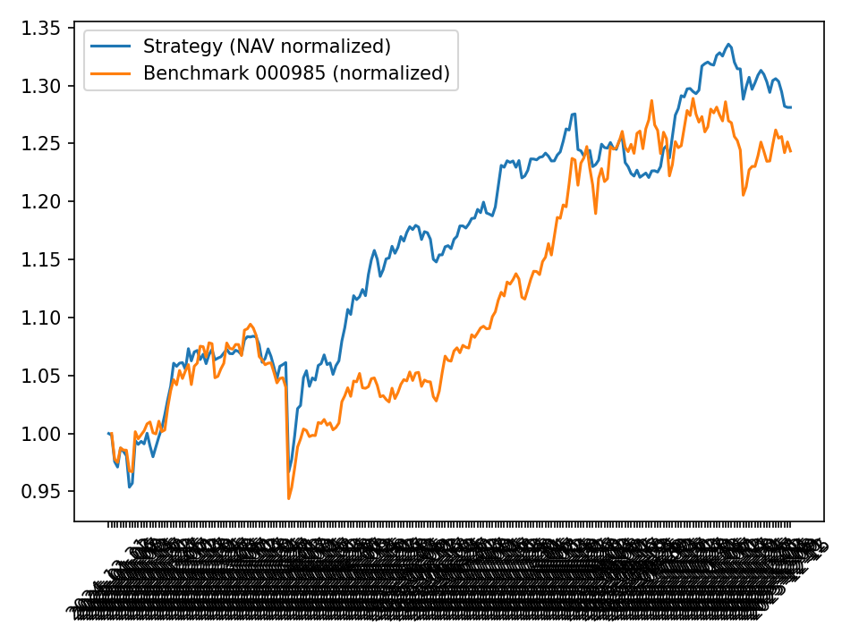

# A股日频选股（400+ 因子）+ LightGBM  
**Alpha158（OHLCV 技术因子）+ Ricequant 财报/基本面因子（300+） · 日频 · A-Share**

基于 **400+ 特征（因子）与机器学习** 的 A 股日频选股策略与可复现工程化流水线。  
核心结果（样本外 2025，TopK=50，含保守交易约束）：

- **净累计收益（含手续费）**：28.12%
- **夏普比率（Sharpe）**：1.776
- **最大回撤（Max Drawdown）**：-10.78%
- **胜率（Hit Rate，日度）**：57.33%
- **Rank IC mean**：0.0681（IC mean：0.0177）

> 说明：以上指标来自 `diagnostics_summary.json`（由回测输出汇总）。

---

## 1. 项目概览

### 1.1 数据工程（2005-01-01 ~ 2025-12-15）
整合两类特征源，构建 A 股**日频面板数据**（交易日 × 股票）：

- **Alpha158**：基于 OHLCV 的衍生技术因子  
- **Ricequant 财报/基本面因子（300+）**：对齐到日频的基本面/财务因子  

数据处理要点：
- 严格交易日历对齐（strict calendar）
- 异常值/缺失值处理、截面标准化
- 特征一致性校验（面向 ML pipeline 的可复用数据集）

产出：可复用的高质量训练/回测数据集（面向 ML pipeline）。

---

### 1.2 严格标签（Strict Label）
\[
y_t = \frac{Close(t+2)}{Close(t+1)} - 1
\]

---

### 1.3 机器学习建模
- 模型：**LightGBM**（回归/排序式信号学习）
- 每个交易日输出全市场预测分数，进行截面选股（TopK）

---

### 1.4 特征筛选与稳定性
标准化因子筛选流程：
- 缺失率/稳定性过滤
- LGBM 正则化 + 重要性约束（含 valid permutation importance）
- 将 ~400 因子自动收敛到“有效因子子集”，提升泛化并降低噪声维度

---

## 2. 回测设置（TopK + 交易约束）

### 2.1 策略
- 策略：TopkDropout (qlib-style)
- **TopK=50**，**n_drop=5**
- 成交价：close（回测脚本中设定）
- shift：1

### 2.2 交易约束（保守规则）
回测纳入 A 股常见可交易性约束：
- 手续费（commission + stamp duty）
- 涨跌停/停牌不可交易
- IPO 冷静期/新股过滤（上市不足 60 个交易日不交易）
- **T+1 资金结算**（settlement_t1=True）

成本模型（bps）：
- 买入：15.0 bps
- 卖出：15.0 bps
- 印花税（卖出）：10.0 bps

涨跌停推断：
- mainboard(10%+5% ST), 300/688(20%), BJ(30%)

---

## 3. 样本外绩效（2025）

评估窗口：
- window：2025-01-02 ~ 2025-12-10
- data_end：2025-12-15

### 3.1 策略自身指标（含手续费）
| 指标 | 数值 |
|---|---:|
| 交易日数量 | 232 |
| 净累计收益（Cumulative Return） | **28.12%** |
| 年化收益（Annual Return） | **28.21%** |
| 年化波动（Annual Volatility） | 15.88% |
| 夏普（Sharpe） | **1.776** |
| 最大回撤（Max Drawdown） | **-10.78%** |
| 胜率（Hit Rate，日度） | **57.33%** |
| 日均收益（Mean Daily Return） | 0.1119% |
| 日收益标准差（Std Daily Return） | 1.0003% |

### 3.2 相对基准（与绘图保持一致：CSI 300）
| 指标 | 数值 |
|---|---:|
| 年化超额收益（Annual Excess Return） | 3.08% |
| 跟踪误差（Tracking Error） | 12.08% |
| 信息比率（IR） | 0.255 |
| Beta | 0.667 |
| Alpha | 0.116 |

### 3.3 交易与费用统计
| 项目 | 数值 |
|---|---:|
| 初始资金 | 1000000 |
| 窗口结束 MTM 资产（window end） | 1294790.04 |
| data_end 资产（含尾部结算） | 1281161.76 |
| 总手续费（Total Fee Paid） | 91322.28 |
| 总成交笔数（Trades Total） | 2122 |
| 买入 / 卖出 | 1061 / 1059 |
| 强制清仓次数（Forced Liquidations） | 2 |

### 3.4 可交易性阻塞（诊断）
买入跳过原因（计数）：
- missing_row：20
- limit_locked：13
- ipo_too_new：20
- lot_too_small：4075

卖出阻塞原因（计数）：
- missing_row：195
- limit_locked：14

---

## 4. IC / RankIC 统计
| 指标 | 数值 |
|---|---:|
| IC mean | 0.01765 |
| IC std | 0.11141 |
| Rank IC mean | **0.06813** |
| Rank IC std | 0.14187 |
| 统计天数（observed days） | 229 |

---

## 5. 回测曲线


---

## 6. 数据集下载（百度网盘）
本仓库不包含完整 `dataset/`（体积较大）。请通过百度网盘下载后放入项目工作目录。

```text
alpha158+ricequant_finance+lgbm数据集
链接: https://pan.baidu.com/s/1yIGTYrIe21nmIMGytfFmeg?pwd=6h8a
提取码: 6h8a
```

下载完成后，请确保目录结构如下（重点是 `dataset/` 放在 `project_alpha158+ricequant_fin+lgbm` 下）：

```text
project_alpha158+ricequant_fin+lgbm/
  dataset/
    rq_ohlcv_yearly_parquet/
    trading_calendar_from_merged.csv
  labeled/
  train_models/
  backtest_20250101_20251210/
```

---

## 7. 复现步骤（Windows CMD）

### Step 1 — 打标签（Labeling）
```bat
cd /d project_alpha158+ricequant_fin+lgbm

python labeled\build_labels_strict_by_calendar_from_ohlcv.py ^
  --feature_dir "labeled" ^
  --ohlcv_dir   "dataset\rq_ohlcv_yearly_parquet" ^
  --calendar_csv "dataset\trading_calendar_from_merged.csv" ^
  --out_dir "_calendar" ^
  --price_col close ^
  --mode append_full
```

输出位置：
```text
labeled\_calendar\labeled_yearly_parquet
```

---

### Step 2 — 训练 LightGBM（Training）
```bat
cd /d project_alpha158+ricequant_fin+lgbm

python train_models\train_lgbm_lambdarank_strict_calendar_v4_fundselect_validperm.py ^
  --data_dir "labeled\_calendar\labeled_yearly_parquet" ^
  --out_dir  "train_models\_train_lambdarank_v4_alpha_plus_fundTop15_seed42" ^
  --train_years 2021-2023 --valid_years 2024 --test_years 2025 ^
  --label_col label__ret_1d_qlib ^
  --missing_drop_thresh 0.98 ^
  --cast_float32 ^
  --exclude_regex "(?i)dividend" ^
  --fund_perm_csv "train_models\feature_importance_valid_perm.csv" ^
  --fund_perm_topk 15 ^
  --fund_perm_min_drop 0 ^
  --clip_y_abs 0 ^
  --relevance_bins 10 ^
  --min_group_size 30 ^
  --truncation_level 50 ^
  --num_boost_round 5000 ^
  --early_stopping_rounds 400 ^
  --save_test_pred ^
  --seed 42
```

训练输出：
```text
train_models\_train_lambdarank_v4_alpha_plus_fundTop15_seed42
```
- `summary.json`：包含 IC / RankIC / IR 等统计

---

### Step 3 — 回测（Backtest）
```bat
cd /d project_alpha158+ricequant_fin+lgbm
python backtest_20250101_20251210\backtest_topk_dropout.py ^
  --model_dir "train_models\_train_lambdarank_v4_alpha_plus_fundTop15_seed42" ^
  --features_dir "labeled\_calendar\labeled_yearly_parquet" ^
  --ohlcv_dir "dataset\rq_ohlcv_yearly_parquet" ^
  --calendar_csv "dataset\trading_calendar_from_merged.csv" ^
  --out_dir "backtest_20250101_20251210\out_topk_dropout_2025" ^
  --topk 50 --n_drop 5 --init_cash 1000000 --settlement_t1
  --enable_benchmark --benchmark_csv "backtest_20250101_20251210\benchmark_000985.csv" ^
  --compute_ic

```

回测输出：
```text
backtest_20250101_20251210\out_topk_dropout_2025
```
- `nav_net_vs_zero_cost.csv`：净值序列（含手续费 vs 零成本）

---

## 8. Repo 结构
```text
project_alpha158+ricequant_fin+lgbm/
  dataset/        # 网盘下载（大文件不提交 Git）
  labeled/        # 严格日历对齐 + 打标签
  train_models/   # LGBM 训练 + 特征筛选
  backtest_20250101_20251210/  # 回测脚本 + 回测输出
```

---

## 9. 免责声明（Disclaimer）
本项目仅用于研究与学习交流，不构成任何投资建议。  
历史回测不代表未来表现，策略可能随市场环境变化而失效。
